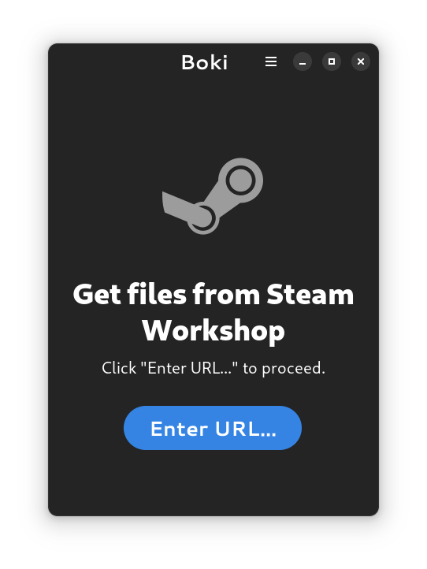
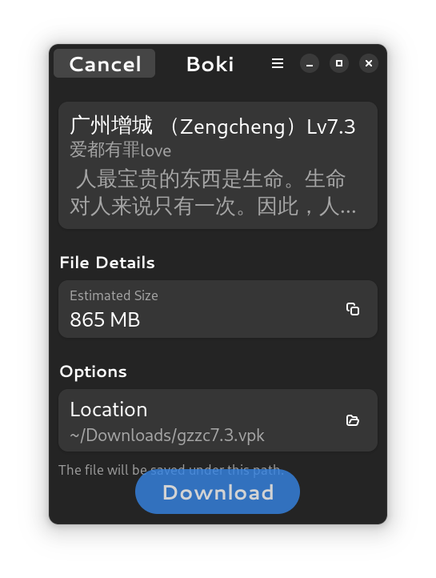
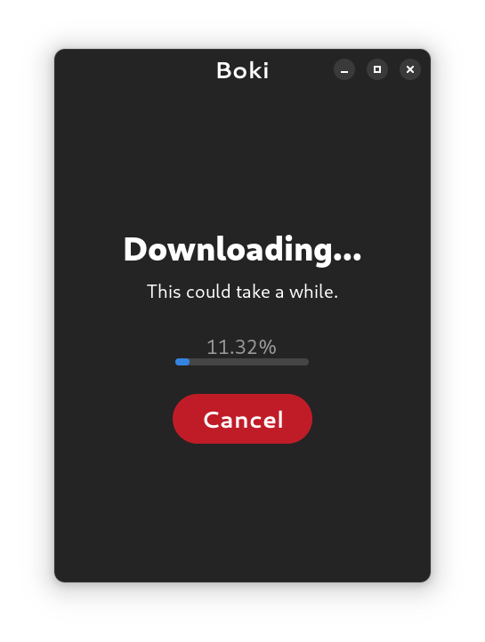

<div align="center">

<br />
<h1>Boki</h1>
</div>
<div align="center">
</div>
<br />

Boki is a Steam Workshop downloader client for the GNOME desktop.

The logo is inspired by an artwork of Tony Zenitium, find it [here](https://zenitium.artstation.com/projects/3dm1XE) and [here](https://www.artstation.com/artwork/3dm1XE) (the latter link is dead).

<p>
	
	
	
</p>


## Development

This project uses Flatpak, an app container technology. Your Linux distro should have this installed by default, otherwise you'll have to install it manually.

Install Flatpak Builder, required to build Flatpak apps:

```sh
flatpak install org.flatpak.Bulder
```

Build and install the app using the `scripts/flatpak-install.sh` script. You can inspect the file's content to see what's running.

Application is now available to be run. Search "Boki" for the desktop shortcut, or run this command:

```sh
flatpak run com.github.kinten108101.Boki
```

### Optional

If you're using an LSP and wish to have linting (e.g. lsp-typescript).

Install the development NPM packages in this project:

```sh
yarn install
```

These packages are type declarations for the GTK and Adwaita libraries. Now you should have working type linting in your IDE.

